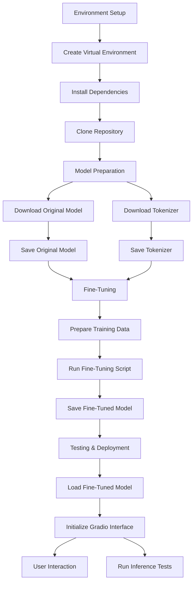
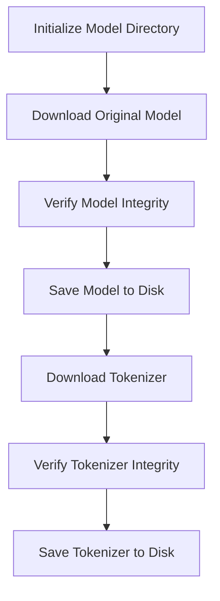
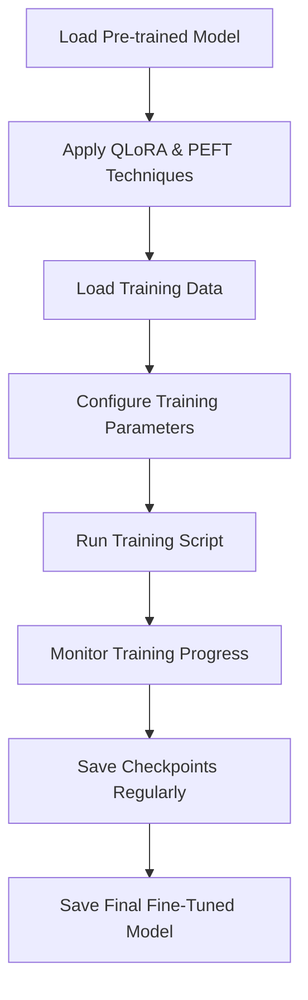
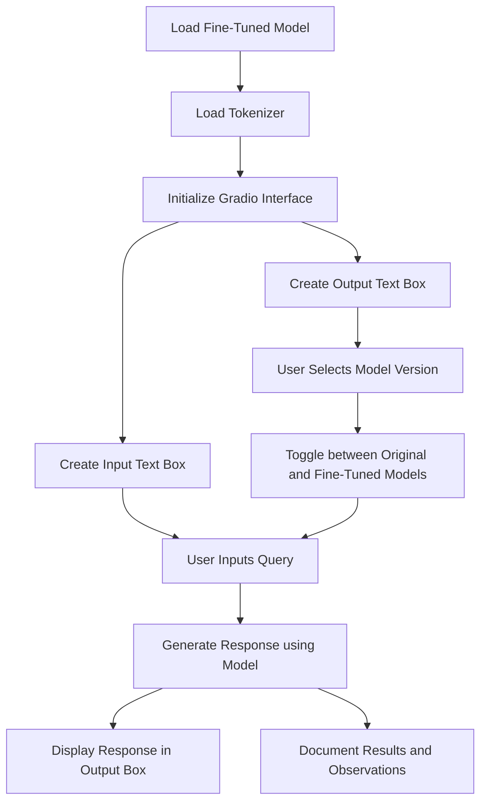
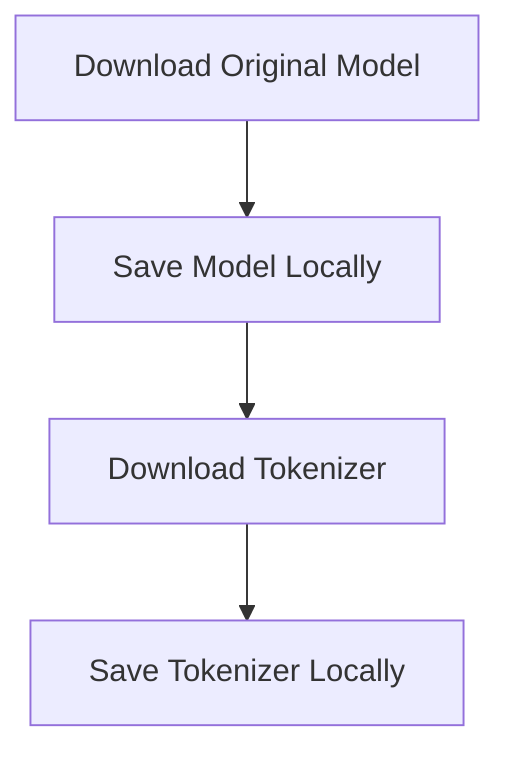
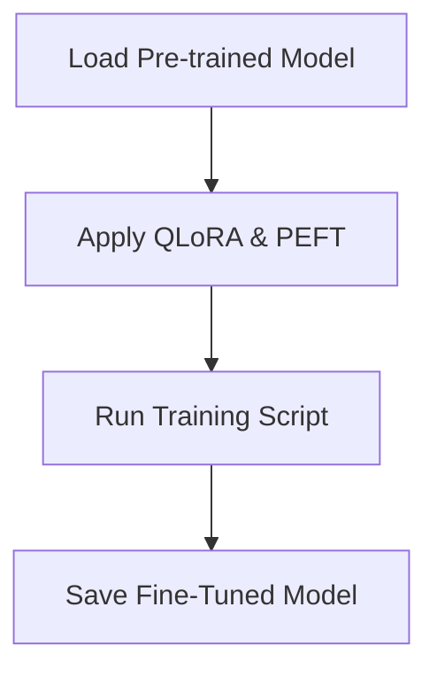
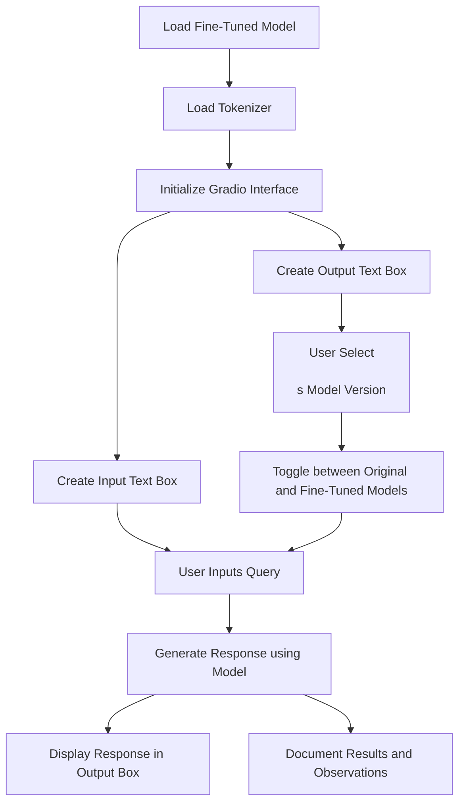

# Open Source Verilog Copilot: Fine Tune LLM with QLoRA and VeriGen Dataset using Unsloth

## Overview
This project aims to develop an open-source Verilog copilot by fine-tuning large language models (LLMs) using QLoRA, PEFT, and Unsloth on the Verigen dataset. The copilot assists in generating high-quality Verilog code, making the hardware design process more efficient and less error-prone.

**Disclaimer:**
This project is designed to be feasible within the constraints of a single GPU setup. Model selection, quantization, and training parameters are optimized for an RTX 3090 GPU. The performance and capabilities of the project may vary based on the hardware specifications. Additionally, library and dependency versions may change over time, affecting the results.

## Project Directory Structure
```
├── llama3_finetune
│   └── checkpoint-60
│       ├── adapter_config.json
│       ├── adapter_model.safetensors
│       ├── optimizer.pt
│       ├── README.md
│       ├── rng_state.pth
│       ├── scheduler.pt
│       ├── special_tokens_map.json
│       ├── tokenizer_config.json
│       ├── tokenizer.json
│       ├── trainer_state.json
│       ├── training_args.bin
├── unsloth_llama3_8b
│   ├── config.json
│   ├── generation_config.json
│   ├── model-00001-of-00002.safetensors
│   ├── model-00002-of-00002.safetensors
│   ├── model.safetensors.index.json
│   ├── special_tokens_map.json
│   ├── tokenizer_config.json
│   ├── tokenizer.json
│   ├── tokenizer.model
├── venv
├── app.py
├── download_unsloth_llama3_8b.py
├── finetune_llama3.py
├── README.md
└── requirements.txt
```

## Workflow


### Model Preparation


### Fine-Tuning


### Testing and Deployment


## Environment Setup
1. **Clone the Repository**:
    ```sh
    git clone <repository_url>
    cd verilog_copilot_project
    ```

2. **Set Up Virtual Environment**:
    ```sh
    python -m venv venv
    source venv/bin/activate
    ```

3. **Install Dependencies**:
    ```sh
    pip install -r requirements.txt
    ```

## Model Preparation


1. **Download Original Model**:
    ```sh
    python download_unsloth_llama3_8b.py
    ```

2. **Download Fine-Tuned Model**:
    Ensure your fine-tuned model files are placed in `output/llama3_finetune/checkpoint-60`.

## Fine-Tuning


This project uses the `Unsloth` package for quantization and fine-tuning due to its efficiency in resource-constrained environments. The fine-tuning script is provided in `finetune_llama3.py`.

🦥 Unsloth: Will patch your computer to enable 2x faster free finetuning.
config.json: 100%|████████████████████████████████████████████████████| 1.20k/1.20k [00:00<00:00, 16.3MB/s]
==((====))==  Unsloth: Fast Llama patching release 2024.6
   \\   /|    GPU: NVIDIA GeForce RTX 3090. Max memory: 24.0 GB. Platform = Linux.
O^O/ \_/ \    Pytorch: 2.3.1+cu121. CUDA = 8.6. CUDA Toolkit = 12.1.
\        /    Bfloat16 = TRUE. Xformers = 0.0.26.post1. FA = False.
 "-____-"     Free Apache license: http://github.com/unslothai/unsloth
model.safetensors: 100%|██████████████████████████████████████████████| 5.70G/5.70G [12:13<00:00, 7.77MB/s]
generation_config.json: 100%|█████████████████████████████████████████████| 172/172 [00:00<00:00, 2.25MB/s]
tokenizer_config.json: 100%|███████████████████████████████████████████| 50.6k/50.6k [00:00<00:00, 230kB/s]
tokenizer.json: 100%|█████████████████████████████████████████████████| 9.09M/9.09M [00:02<00:00, 4.39MB/s]
special_tokens_map.json: 100%|████████████████████████████████████████████| 464/464 [00:00<00:00, 6.22MB/s]
Special tokens have been added in the vocabulary, make sure the associated word embeddings are fine-tuned or trained.
Unsloth 2024.6 patched 32 layers with 32 QKV layers, 32 O layers and 32 MLP layers.
Map: 100%|█████████████████████████████████████████████████| 108971/108971 [02:23<00:00, 760.05 examples/s]
max_steps is given, it will override any value given in num_train_epochs
==((====))==  Unsloth - 2x faster free finetuning | Num GPUs = 1
   \\   /|    Num examples = 108,971 | Num Epochs = 1
O^O/ \_/ \    Batch size per device = 2 | Gradient Accumulation steps = 4
\        /    Total batch size = 8 | Total steps = 60
 "-____-"     Number of trainable parameters = 41,943,040
{'loss': 0.8702, 'grad_norm': 0.23352308571338654, 'learning_rate': 5e-06, 'epoch': 0.0}                   
{'loss': 0.7185, 'grad_norm': 0.20793183147907257, 'learning_rate': 1e-05, 'epoch': 0.0}                   
{'loss': 0.8745, 'grad_norm': 0.2324608415365219, 'learning_rate': 1.5e-05, 'epoch': 0.0}                  
{'loss': 1.0737, 'grad_norm': 0.2528074085712433, 'learning_rate': 2e-05, 'epoch': 0.0}                    
{'loss': 0.8528, 'grad_norm': 0.2972744405269623, 'learning_rate': 2.5e-05, 'epoch': 0.0}                  
{'loss': 1.1018, 'grad_norm': 0.2701590955257416, 'learning_rate': 3e-05, 'epoch': 0.0}                    
{'loss': 1.0596, 'grad_norm': 0.23280449211597443, 'learning_rate': 3.5e-05, 'epoch': 0.0}                 
{'loss': 0.8212, 'grad_norm': 0.20562133193016052, 'learning_rate': 4e-05, 'epoch': 0.0}                   
{'loss': 0.9318, 'grad_norm': 0.21799467504024506, 'learning_rate': 4.5e-05, 'epoch': 0.0}                 
{'loss': 0.7615, 'grad_norm': 0.3326791524887085, 'learning_rate': 5e-05, 'epoch': 0.0}                    
{'loss': 0.7269, 'grad_norm': 0.20206224918365479, 'learning_rate': 4.9e-05, 'epoch': 0.0}                 
{'loss': 1.0058, 'grad_norm': 0.27746373414993286, 'learning_rate': 4.8e-05, 'epoch': 0.0}                 
{'loss': 0.8164, 'grad_norm': 0.3658866286277771, 'learning_rate': 4.7e-05, 'epoch': 0.0}                  
{'loss': 0.9976, 'grad_norm': 0.23685322701931, 'learning_rate': 4.600000000000001e-05, 'epoch': 0.0}      
{'loss': 0.7798, 'grad_norm': 0.25426965951919556, 'learning_rate': 4.5e-05, 'epoch': 0.0}                 
{'loss': 0.711, 'grad_norm': 0.2023640125989914, 'learning_rate': 4.4000000000000006e-05, 'epoch': 0.0}    
{'loss': 1.1191, 'grad_norm': 0.32870209217071533, 'learning_rate': 4.3e-05, 'epoch': 0.0}                 
{'loss': 0.9139, 'grad_norm': 0.18491601943969727, 'learning_rate': 4.2e-05, 'epoch': 0.0}                 
{'loss': 0.7207, 'grad_norm': 0.22200925648212433, 'learning_rate': 4.1e-05, 'epoch': 0.0}                 
{'loss': 1.1067, 'grad_norm': 0.23293443024158478, 'learning_rate': 4e-05, 'epoch': 0.0}                   
{'loss': 0.7371, 'grad_norm': 0.37893006205558777, 'learning_rate': 3.9000000000000006e-05, 'epoch': 0.0}  
{'loss': 0.9419, 'grad_norm': 0.15902665257453918, 'learning_rate': 3.8e-05, 'epoch': 0.0}                 
{'loss': 0.9036, 'grad_norm': 0.2646190822124481, 'learning_rate': 3.7e-05, 'epoch': 0.0}                  
{'loss': 0.8309, 'grad_norm': 0.18428869545459747, 'learning_rate': 3.6e-05, 'epoch': 0.0}                 
{'loss': 0.9702, 'grad_norm': 0.32114851474761963, 'learning_rate': 3.5e-05, 'epoch': 0.0}                 
{'loss': 1.1126, 'grad_norm': 0.32829004526138306, 'learning_rate': 3.4000000000000007e-05, 'epoch': 0.0}  
{'loss': 1.0442, 'grad_norm': 0.25829723477363586, 'learning_rate': 3.3e-05, 'epoch': 0.0}                 
{'loss': 0.6913, 'grad_norm': 0.26512542366981506, 'learning_rate': 3.2000000000000005e-05, 'epoch': 0.0}  
{'loss': 0.8817, 'grad_norm': 0.18741697072982788, 'learning_rate': 3.1e-05, 'epoch': 0.0}                 
{'loss': 0.8038, 'grad_norm': 0.20668251812458038, 'learning_rate': 3e-05, 'epoch': 0.0}                   
{'loss': 0.741, 'grad_norm': 0.20079535245895386, 'learning_rate': 2.9e-05, 'epoch': 0.0}                  
{'loss': 0.9376, 'grad_norm': 0.24099944531917572, 'learning_rate': 2.8000000000000003e-05, 'epoch': 0.0}  
{'loss': 0.8542, 'grad_norm': 0.2100389450788498, 'learning_rate': 2.7000000000000002e-05, 'epoch': 0.0}   
{'loss': 0.8448, 'grad_norm': 0.18733343482017517, 'learning_rate': 2.6000000000000002e-05, 'epoch': 0.0}  
{'loss': 1.0157, 'grad_norm': 0.22578302025794983, 'learning_rate': 2.5e-05, 'epoch': 0.0}                 
{'loss': 0.7649, 'grad_norm': 0.29417797923088074, 'learning_rate': 2.4e-05, 'epoch': 0.0}                 
{'loss': 0.9213, 'grad_norm': 0.24903401732444763, 'learning_rate': 2.3000000000000003e-05, 'epoch': 0.0}  
{'loss': 0.8798, 'grad_norm': 0.17288818955421448, 'learning_rate': 2.2000000000000003e-05, 'epoch': 0.0}  
{'loss': 1.0014, 'grad_norm': 0.2931334674358368, 'learning_rate': 2.1e-05, 'epoch': 0.0}                  
{'loss': 0.6411, 'grad_norm': 0.27209487557411194, 'learning_rate': 2e-05, 'epoch': 0.0}                   
{'loss': 0.8347, 'grad_norm': 0.2903622090816498, 'learning_rate': 1.9e-05, 'epoch': 0.0}                  
{'loss': 0.7657, 'grad_norm': 0.22751733660697937, 'learning_rate': 1.8e-05, 'epoch': 0.0}                 
{'loss': 0.7963, 'grad_norm': 0.3043607771396637, 'learning_rate': 1.7000000000000003e-05, 'epoch': 0.0}   
{'loss': 0.5493, 'grad_norm': 0.19301261007785797, 'learning_rate': 1.6000000000000003e-05, 'epoch': 0.0}  
{'loss': 0.8743, 'grad_norm': 0.25478699803352356, 'learning_rate': 1.5e-05, 'epoch': 0.0}                 
{'loss': 1.0055, 'grad_norm': 0.23564529418945312, 'learning_rate': 1.4000000000000001e-05, 'epoch': 0.0}  
{'loss': 0.813, 'grad_norm': 0.3418455421924591, 'learning_rate': 1.3000000000000001e-05, 'epoch': 0.0}    
{'loss': 0.8584, 'grad_norm': 0.22712750732898712, 'learning_rate': 1.2e-05, 'epoch': 0.0}                 
{'loss': 0.8951, 'grad_norm': 0.28081202507019043, 'learning_rate': 1.1000000000000001e-05, 'epoch': 0.0}  
{'loss': 0.955, 'grad_norm': 0.30049294233322144, 'learning_rate': 1e-05, 'epoch': 0.0}                    
{'loss': 0.6989, 'grad_norm': 0.23726198077201843, 'learning_rate': 9e-06, 'epoch': 0.0}                   
{'loss': 0.6038, 'grad_norm': 0.29510775208473206, 'learning_rate': 8.000000000000001e-06, 'epoch': 0.0}   
{'loss': 0.8343, 'grad_norm': 0.2571757733821869, 'learning_rate': 7.000000000000001e-06, 'epoch': 0.0}    
{'loss': 0.7887, 'grad_norm': 0.24695414304733276, 'learning_rate': 6e-06, 'epoch': 0.0}                   
{'loss': 0.7763, 'grad_norm': 0.2661164104938507, 'learning_rate': 5e-06, 'epoch': 0.0}                    
{'loss': 0.7923, 'grad_norm': 0.25235313177108765, 'learning_rate': 4.000000000000001e-06, 'epoch': 0.0}   
{'loss': 0.7552, 'grad_norm': 0.2831136882305145, 'learning_rate': 3e-06, 'epoch': 0.0}                    
{'loss': 0.7584, 'grad_norm': 0.2157314568758011, 'learning_rate': 2.0000000000000003e-06, 'epoch': 0.0}   
{'loss': 1.042, 'grad_norm': 0.32682257890701294, 'learning_rate': 1.0000000000000002e-06, 'epoch': 0.0}   
{'loss': 0.9465, 'grad_norm': 0.2684042155742645, 'learning_rate': 0.0, 'epoch': 0.0}                      
{'train_runtime': 674.1454, 'train_samples_per_second': 0.712, 'train_steps_per_second': 0.089, 'train_loss': 0.863763881723086, 'epoch': 0.0}
100%|██████████████████████████████████████████████████████████████████████| 60/60 [11:14<00:00, 11.24s/it]
Fine-tuning completed

## Testing
To test the model, run the `app.py` script. This script uses Gradio to create a web interface for testing the original and fine-tuned models.
```sh
python app.py
```

Developed a simple Gradio UI for this project where you can switch back and forth between the original and fine-tuned models to compare their outputs.

## Justifications and Explanations
### Why Quantize Using Unsloth?
Quantization reduces the model size and memory usage, making it feasible to run large models on resource-limited hardware like a single RTX 3090 GPU. Unsloth specifically optimizes models for efficient inference without significant loss in performance.

### Why Use QLoRA and PEFT?
QLoRA and PEFT (Parameter-Efficient Fine-Tuning) are chosen because they allow for efficient fine-tuning of large language models. These techniques minimize the need for extensive computational resources by updating only a subset of the model parameters, making them ideal for users with limited hardware.

### Training Arguments and Settings
The training settings are chosen to balance performance and resource constraints. For example:
- **Batch Size**: Set to fit within GPU memory limits.
- **Learning Rate and Epochs**: Tuned to ensure the model converges without overfitting.
- **Gradient Accumulation**: Used to simulate larger batch sizes.

## Credits
This project utilizes the Verigen dataset for training and evaluation. Special thanks to the authors:
- **Shailja Thakur**, **Baleegh Ahmad**, **Hammond Pearce**, **Benjamin Tan**, **Brendan Dolan-Gavitt**, **Ramesh Karri**, **Siddharth Garg**.

[Benchmarking Large Language Models for Automated Verilog RTL Code Generation](https://arxiv.org/abs/2212.11140)

## Architecture Diagram

### Overall Workflow


### Model Preparation


### Fine-Tuning


### Testing and Deployment
